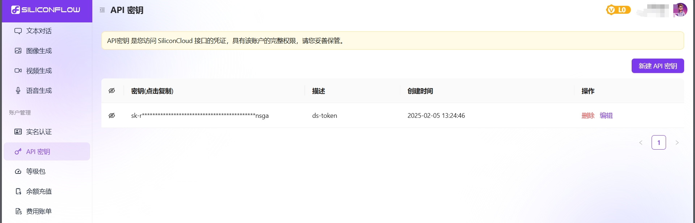

# WeChat-in-AI
使用 wxauto 框架，采用RPA自动化方式，监听微信消息。


## 使用方法

1、注册一个硅基流动的账号，免费赠送14元额度。邀请链接：https://cloud.siliconflow.cn/i/nfnNT0Zg

2、创建一个 API 密钥，复制保存好。



3、配置程序

所有的配置都在 `config.py` 配置文件中进行配置。

（1）填充 API 密钥。

```python
# API 密钥
DEEPSEEK_API_KEY = 'sk-'

#
```

（2）修改监听列表，当前只推荐监听人员，不推荐群聊（群聊的逻辑还没写好）。

```python
### 微信的参数配置 ###

# 监听消息列表
PERSON_LISTEN_LIST = ['xxxx', 'xxx'] # 填你想聊天的人的微信备注
GROUP_LISTEN_LIST = ['']
```

（3）修改你想使用的模型，推荐DeepSeek-V3，没那么卡。

```python
# 模型
MODEL = 'deepseek-ai/DeepSeek-V3'
# MODEL = 'deepseek-ai/DeepSeek-R1'
# MODEL = 'Pro/deepseek-ai/DeepSeek-R1'
# MODEL = 'deepseek-ai/DeepSeek-R1-Distill-Qwen-32B'
# MODEL = 'deepseek-ai/DeepSeek-R1-Distill-Llama-8B'
# MODEL = 'deepseek-ai/DeepSeek-R1-Distill-Qwen-14B'
# MODEL = 'Pro/deepseek-ai/DeepSeek-R1-Distill-Qwen-7B'
```

（4）修改Prompt提示词

修改 prompt.md 文件，当前默认角色是林黛玉。


4、运行程序

下载文件到本地，需要有python环境

（1）安装依赖：

```bash
pip install -r requirements
```

（2）运行程序：

```bash
python main.py
```